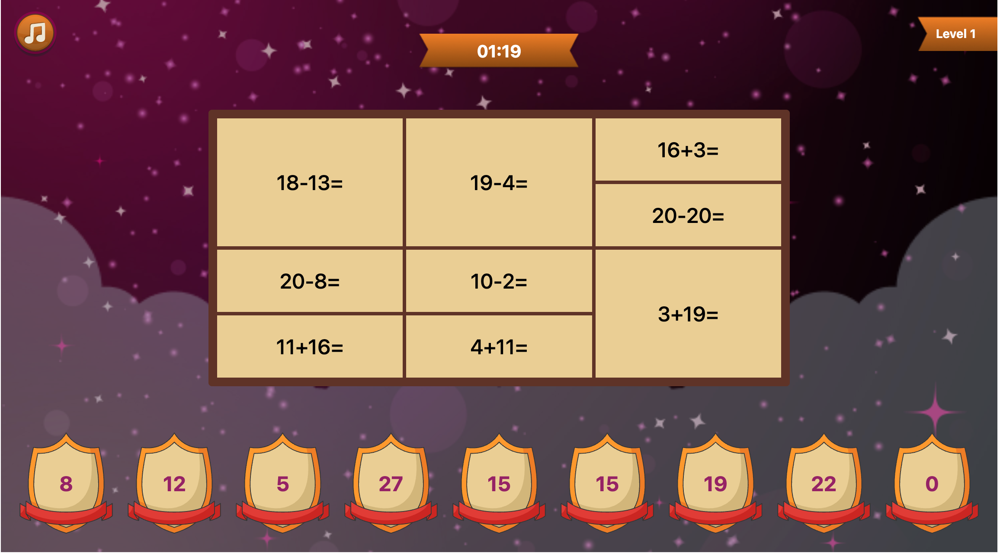
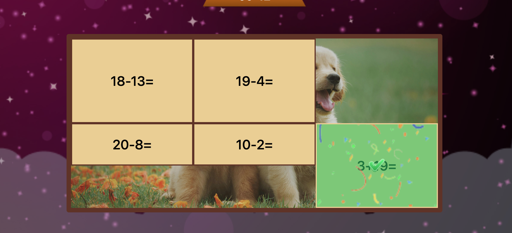
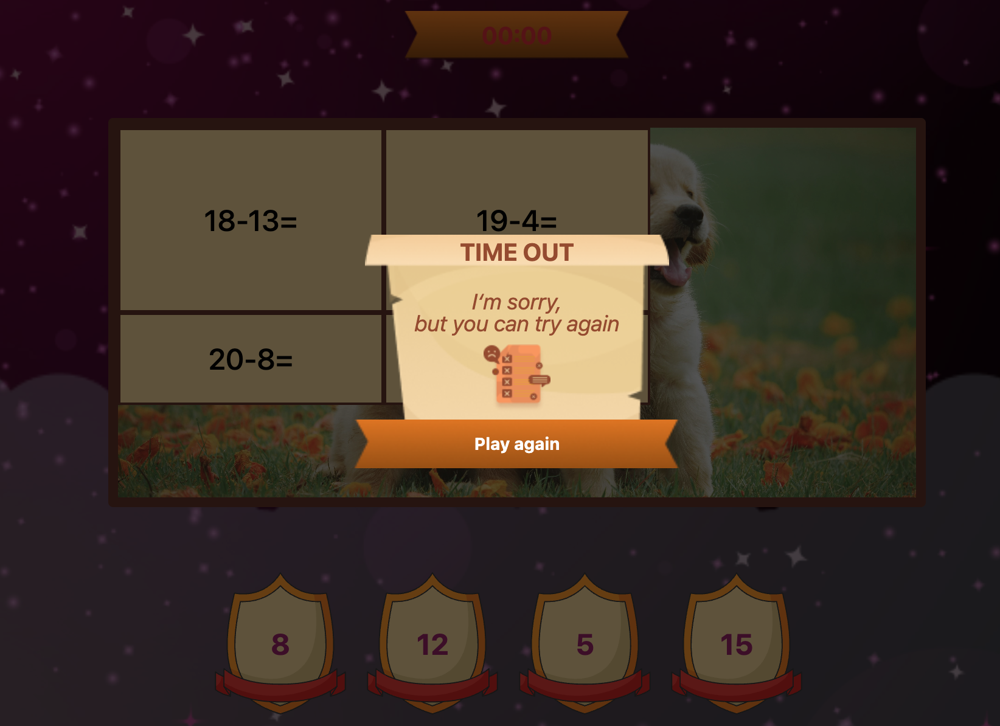

# Funny Theorapy game

This README provides an overview of the React + TypeScript + Vite product for a simple therapy game. The game allows users to drag numbers to a block of math.

## Installation

To install and run the project locally, follow these steps:

1. Clone the repository to your local machine.
2. Navigate to the project directory.
3. Run `npm i` or `yarn` to install the dependencies.
4. Run `npm run dev` or `yarn dev` to start the development server.

## Features
Once the development server is running, you can access the game by opening it in your web browser. 
You can check out a live demo of the therapy game [here](https://theorapy-game.vercel.app/)

Here are some key features of the therapy game:

- Drag and drop functionality for numbers
- Interactive math block
- Game mechanics for an engaging experience

## Tech keywords
React + TypeScript + Vite Product
